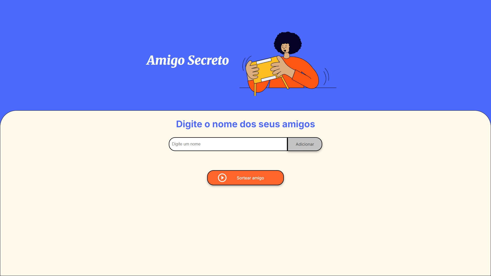

# Olá! Este é o resultado do desafio "Amigo Secreto" Oracle ONE G8

Neste desafio foi usada a linguagem Javascript para implementar as lógicas e funções para realizar um sorteio de amigo secreto de acordo com as descrições enviadas.

## Ferramentas utilizadas:

* Linguagem Javascript

## Feito por:

### Maycon Guerra

### Linkedin: https://www.linkedin.com/in/maycon-war-dev-3d